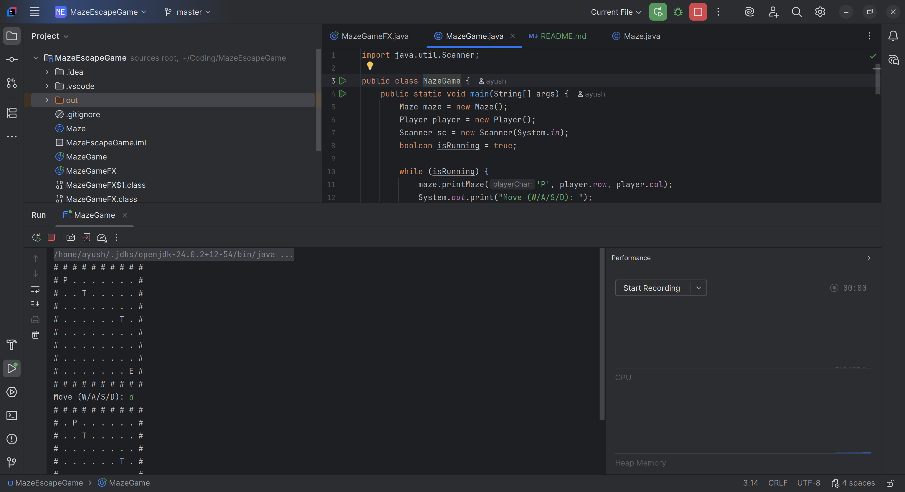

# 🎮 JavaFX Maze Game

[](https://www.oracle.com/java/)
[](https://openjfx.io/)
[](LICENSE)
[](../../issues)

> **A fun, fast, and minimal maze-solving game built with JavaFX.**  
> Navigate your way through randomly generated mazes, dodge traps, and set your best time!

---

## 🖼 Preview

<p align="center">
  
</p>

---

## ✨ Features

- 🧩 **Random maze generation** (recursive backtracker)
- 🎯 **Player movement** with arrow keys or WASD
- 💣 **Random traps** with time penalties
- ⏱ **Timer and move counter**
- 🏆 **Automatic high score saving**
- 🔄 Restart (`R`) or generate a new maze (`N`) anytime

---

## 🎮 How to Play

1. **Clone this repository:**
   ```bash
   git clone https://github.com/ayush-techx/MazeEscapeGame.git
   cd MazeEscapeGame

